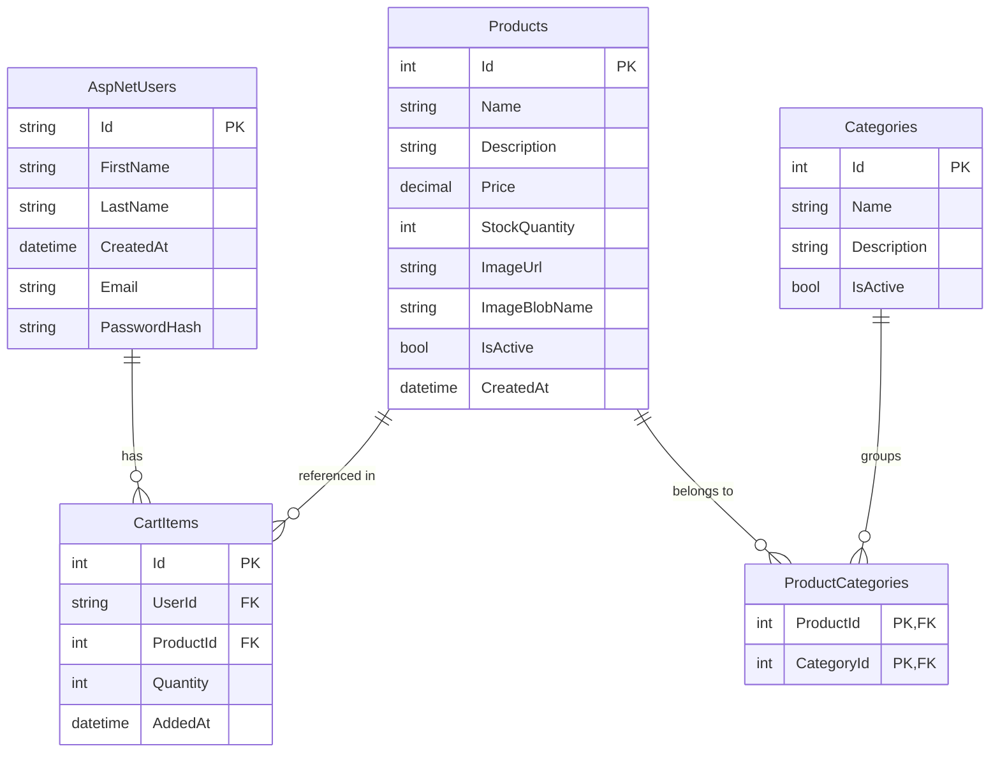

# Ecommerce App

A full-stack e-commerce application built with Blazor WebAssembly and ASP.NET Core 8, featuring product management, user authentication, and a persistent shopping cart.

# Demo Site
https://app-ecommerce-prince-brc8eddrbse9e5hx.southeastasia-01.azurewebsites.net/

---

## Technologies

### Backend (`Server/`)
| Technology | Purpose |
|---|---|
| ASP.NET Core 8 Web API | REST API and application host |
| Entity Framework Core 8 | ORM and database migrations |
| SQL Server (Azure SQL) | Relational database |
| ASP.NET Core Identity | User management and password hashing |
| JWT Bearer Authentication | Stateless API authentication |
| Azure Blob Storage | Product image storage |
| Swagger / Swashbuckle | API documentation (development) |

### Frontend (`Client/`)
| Technology | Purpose |
|---|---|
| Blazor WebAssembly (.NET 8) | SPA hosted by the ASP.NET Core server |
| Microsoft.AspNetCore.Components.Authorization | Role-based UI rendering |
| System.IdentityModel.Tokens.Jwt | JWT parsing on the client |

### Shared (`Shared/`)
- DTOs shared between client and server to keep request/response contracts in sync.

### Testing (`tests/`)
| Library | Purpose |
|---|---|
| xUnit | Test runner |
| Moq | Mocking dependencies |
| FluentAssertions | Readable test assertions |
| Microsoft.AspNetCore.Mvc.Testing | Integration tests via `TestWebApplicationFactory` |
| EF Core InMemory | In-memory database for integration tests |
| bUnit | Blazor component unit tests |

---

## Prerequisites

- [.NET 8 SDK](https://dotnet.microsoft.com/download/dotnet/8.0)
- SQL Server instance or an Azure SQL database
- Azure Storage Account (for product images)
- Git

---

## Installation

### 1. Clone the repository

```bash
git clone <repository-url>
cd Ecommerce
```

### 2. Configure the server

Copy `Server/appsettings.json` and create `Server/appsettings.Development.json` (or update the existing file) with your own values:

```json
{
  "ConnectionStrings": {
    "DefaultConnection": "Server=<your-server>;Initial Catalog=EcommerceDb;User ID=<user>;Password=<password>;Encrypt=True;"
  },
  "Jwt": {
    "Key": "<at-least-32-character-secret-key>",
    "Issuer": "EcommerceApp",
    "Audience": "EcommerceApp",
    "ExpiresHours": "24"
  },
  "AzureBlobStorage": {
    "ConnectionString": "<your-azure-storage-connection-string>",
    "ContainerName": "product-images"
  }
}
```

> **Security:** Never commit real credentials. Add `appsettings.Development.json` to `.gitignore` or use [.NET User Secrets](https://learn.microsoft.com/en-us/aspnet/core/security/app-secrets).

### 3. Apply database migrations

```bash
dotnet ef database update --project Server
```

This creates the schema and seeds the admin account:
- **Email:** `admin@ecommerce.com`
- **Password:** `Admin@123!`

### 4. Run the application

```bash
dotnet run --project Server
```

The server hosts both the API and the Blazor WASM client. Navigate to `https://localhost:<port>` in your browser.

---

## Running Tests

```bash
# All tests
dotnet test

# Server unit + integration tests only
dotnet test tests/Ecommerce.Server.Tests

# Client component tests only
dotnet test tests/Ecommerce.Client.Tests
```

Integration tests use an in-memory database and a stub blob storage service — no external dependencies required.

---

## Project Structure

```
Ecommerce.sln
├── Server/          # ASP.NET Core 8 API + Blazor host
├── Client/          # Blazor WebAssembly SPA
├── Shared/          # Shared DTOs
└── tests/
    ├── Ecommerce.Server.Tests/   # xUnit unit + integration tests (32 tests)
    └── Ecommerce.Client.Tests/   # bUnit component tests (5 tests)
```

---

## Entity Relationship Diagram


